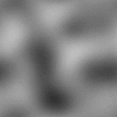
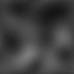

# PerlinMaps
A collection of Perlin noise animated seamless tilable textures, 3 octave variants with 3 zoom levels each.

All maps are 16bit 512px png.
Loops are 20 frames long at 0.05 noise disorder increments.

CC-BY-4.0

## 1 Octave

   

## 2 Octaves

   

## 3 Octaves

  